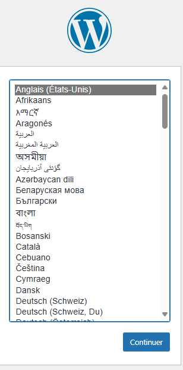
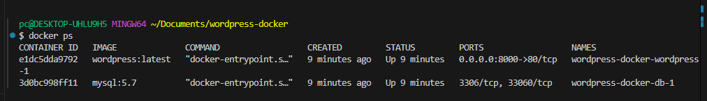

#  Installation de WordPress avec Docker Compose

##  Description du projet

Ce projet déploie **WordPress** et **MySQL** sous forme de microservices avec **Docker Compose**.  
Il permet de créer rapidement un environnement de blog isolé, idéal pour le développement, les tests ou l’apprentissage.

---

##  Technologies utilisées

- Docker
- Docker Compose
- WordPress (CMS)
- MySQL 5.7

---

##  Structure du projet

wordpress-docker/
├── docker-compose.yaml # Configuration des services WordPress & MySQL
├── README.md # Explication et documentation du projet

---

##  Instructions de déploiement

1. **Cloner le projet** :
   ```bash
   git clone https://github.com/onix-pigier/-wordpress-docker.git
   cd wordpress-docker


2. **Demarrer les ervices en mode détaché**

docker compose up -d

3. **Accéder à WordPress**
👉 http://localhost:8000

4. Persistance des données
Un volume nommé db_data est utilisé pour conserver les données MySQL même si les conteneurs sont arrêtés ou supprimés.

 ## Arrêt et réinitialisation
 
   - **Arrêter les conteneurs :**

docker compose down

- **Supprimer les volumes (réinitialisation) :**

docker compose down -v

---

##  Captures d'écran

###  Page d’accueil WordPress


###  Conteneurs Docker actifs

  et autres images restantes : 


